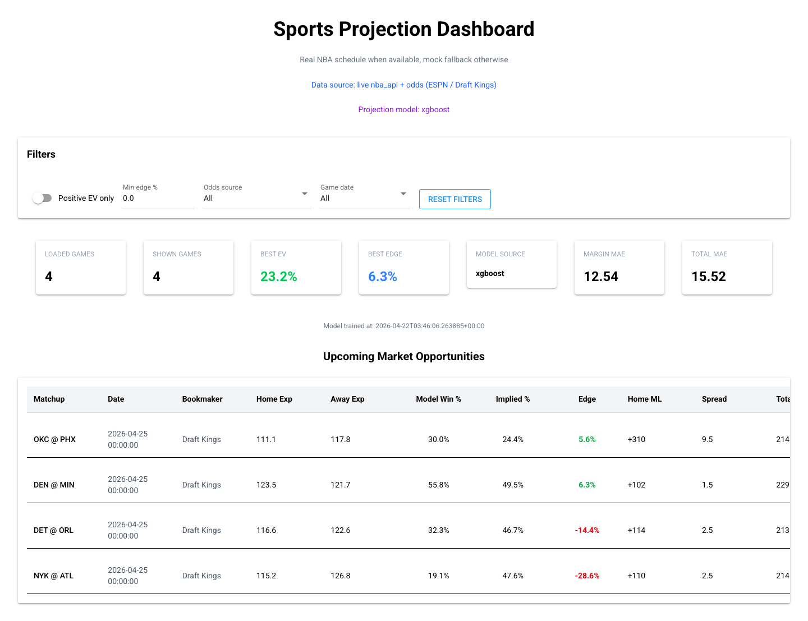

# sports-projection

[](https://github.com/genehuh39/sports-projection/actions/workflows/test.yml)
[](https://github.com/genehuh39/sports-projection/releases)
[](https://www.python.org/downloads/)
[](LICENSE)

NBA game projections and betting-value dashboard. Pulls live schedules and odds, runs an XGBoost projection model with schedule-strength and injury-aware adjustments, and surfaces edge / EV against bookmaker prices.



## What's interesting about it

This is a small project, but it's been built honestly. Two things worth pointing at:

- **Walk-forward CV before tuning.** `sports-eval` runs 6 chronological folds and reports mean ± std MAE, so the noise floor (~±0.6 margin points) is visible before claiming any improvement. Several "obviously good" features turned out to be statistically indistinguishable from the baseline; the README and commit history reflect those negative results rather than hiding them.
- **A calibration knob that was wrong, found and fixed.** The injury-adjustment damping factor shipped at 0.35 (from public research). Walk-forward calibration showed it was actively degrading predictions by ~2.7 margin points. Lowered to 0.05; even at the optimum, the adjustment is roughly a no-op. See `sports-calibrate`.

## Quick start

On macOS, install the OpenMP runtime that XGBoost requires:

```bash
brew install libomp
```

Install dependencies:

```bash
uv sync
```

## Commands

| Command | What it does |
|---|---|
| `uv run sports-projection` | Terminal pipeline — fetches games, prints projections + EV |
| `uv run sports-dashboard`  | NiceGUI dashboard at `localhost:8080` (auto-picks next port if busy) |
| `uv run sports-train`      | Trains the XGBoost model and saves to `artifacts/nba_projection_model.joblib` |
| `uv run sports-eval`       | Walk-forward CV over 6 folds, reports per-fold and aggregate MAE |
| `uv run sports-calibrate`  | Sweeps injury damping factors against historical box scores |
| `uv run sports-test`       | Test suite |

`sports-eval` and `sports-calibrate` accept positional args, e.g. `uv run sports-eval 8 100` for 8 folds × 100 games each.

## How the model works

For each upcoming game, the projection engine builds per-team pregame features and feeds them to two XGBoost regressors (one for margin, one for total).

**Features (37 total):**
- Recent form (10-game rolling): offense, defense, margin, pace, win rate
- Season form (expanding mean): offense, defense, margin, pace, win rate
- Rest-day count and back-to-back flags
- Games played to-date
- Simple Rating System (SRS) rating, computed leakage-free per game date
- Differentials between home and away on each of the above

**Post-prediction adjustments:**
- ESPN injury feed → per-team "points absent," weighted by status (Out / Doubtful / Questionable / Day-to-day)
- Damping factor `0.05` calibrated empirically — see `sports-calibrate`
- Players inactive in the last 10 games are filtered out (their absence is already baked into the rolling features)

**Current out-of-sample performance** (6-fold walk-forward CV on 2024-25 + 2025-26):
- Margin MAE: **12.13 ± 0.59** points
- Total MAE: **16.54 ± 0.89** points

The ±0.59 std is the noise floor — any future change smaller than ~1.2 margin points (2σ) is statistically indistinguishable.

## Dashboard

Filters: positive-EV only, minimum edge %, odds source, game date.

If port `8080` is busy the app picks the next open port. Override with `PORT`:

```bash
PORT=8081 uv run sports-dashboard
```

## Optional: The Odds API

For higher-quality odds, set `THE_ODDS_API_KEY` and the app will prefer it over ESPN:

```bash
export THE_ODDS_API_KEY=your_key_here
uv run sports-dashboard
```

## Repo structure

```
src/
├── data/
│   ├── nba_fetcher.py        live schedule + odds + team form
│   ├── odds_providers.py     ESPN / DraftKings / The Odds API
│   └── injury_provider.py    ESPN injury feed → per-team points absent
├── models/
│   ├── advanced_engine.py    projection engine, applies adjustments
│   ├── trained_nba_model.py  feature engineering, training, CV, calibration
│   └── value_engine.py       implied probability, edge, EV math
├── ui/
│   └── main_ui.py            NiceGUI dashboard
├── pipeline.py               terminal pipeline entry
└── cli.py                    CLI command dispatch
tests/
└── test_engines.py
```

## Caveats

- Third-party data sources (`nba_api`, ESPN, optional The Odds API) — check their ToS before heavy use.
- EV calculation is currently based on the home-side moneyline.
- Damping factor for injuries is calibrated against a historical proxy (top-N rotation by season MPG); the production path uses today's ESPN injury list, which may differ from what `sports-calibrate` measures against.
- Bookmaker coverage depends on what each source publishes for a given game.

## License

MIT
